# Research Figure Gallery

[Figure index and vector downloads](README.md)

## Graphical abstract: Streaming motion forecasting: research contributions

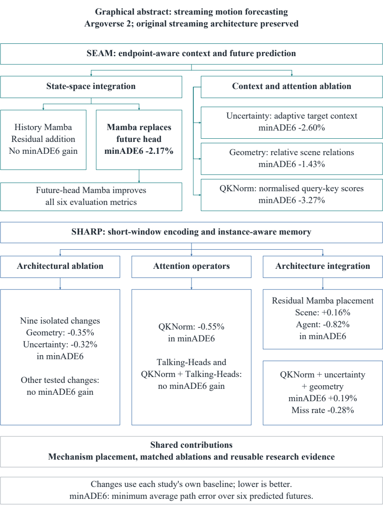

[SVG](Overview/graphical_abstract.svg) / [PDF](Overview/graphical_abstract.pdf) / [PNG](Overview/graphical_abstract.png)

## 3.1: Experimental programme

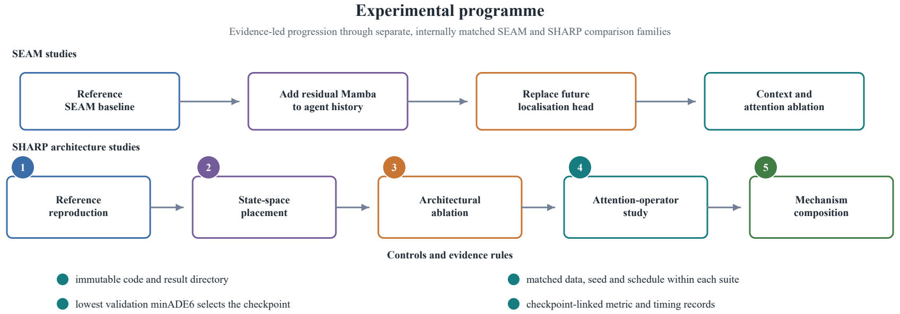

[SVG](Overview/experimental_programme.svg) / [PDF](Overview/experimental_programme.pdf) / [PNG](Overview/experimental_programme.png)

## 2.1: Evolution of learned motion forecasting

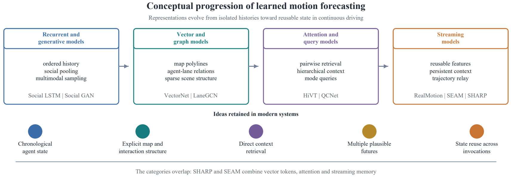

[SVG](Foundations/forecasting_research_landscape.svg) / [PDF](Foundations/forecasting_research_landscape.pdf) / [PNG](Foundations/forecasting_research_landscape.png)

## 2.2: Attention and state-space inductive biases

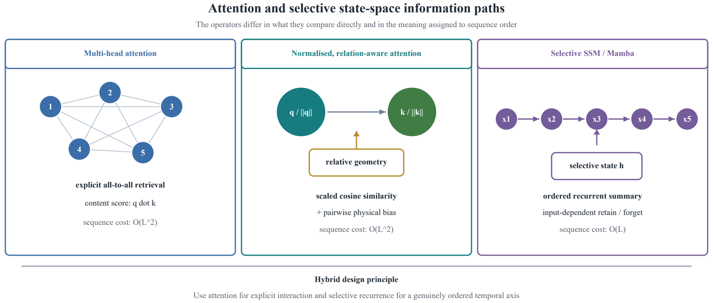

[SVG](Foundations/attention_state_space_comparison.svg) / [PDF](Foundations/attention_state_space_comparison.pdf) / [PNG](Foundations/attention_state_space_comparison.png)

## 2.3: SEAM endpoint-aware streaming

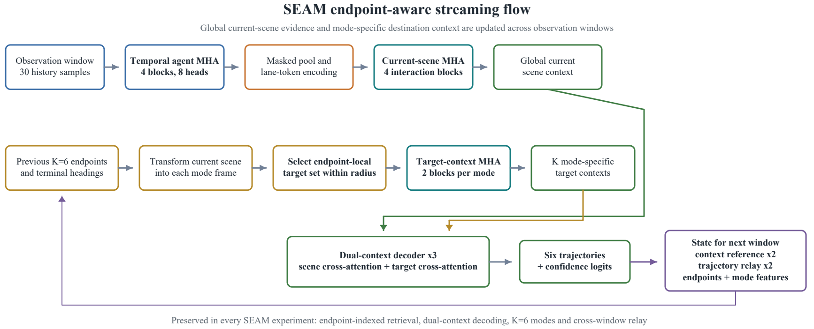

[SVG](Architectures/SEAM/endpoint_aware_streaming.svg) / [PDF](Architectures/SEAM/endpoint_aware_streaming.pdf) / [PNG](Architectures/SEAM/endpoint_aware_streaming.png)

## 3.2: SEAM architecture and Mamba placements

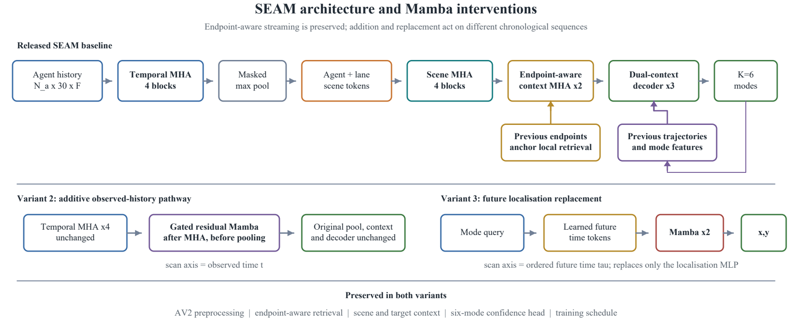

[SVG](Architectures/SEAM/state_space_intervention_locations.svg) / [PDF](Architectures/SEAM/state_space_intervention_locations.pdf) / [PNG](Architectures/SEAM/state_space_intervention_locations.png)

## 3.3: SEAM context and attention interventions

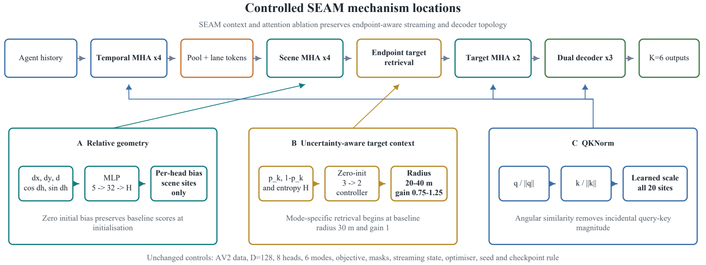

[SVG](Architectures/SEAM/context_attention_intervention_locations.svg) / [PDF](Architectures/SEAM/context_attention_intervention_locations.pdf) / [PNG](Architectures/SEAM/context_attention_intervention_locations.png)

## 3.4: SHARP reference architecture

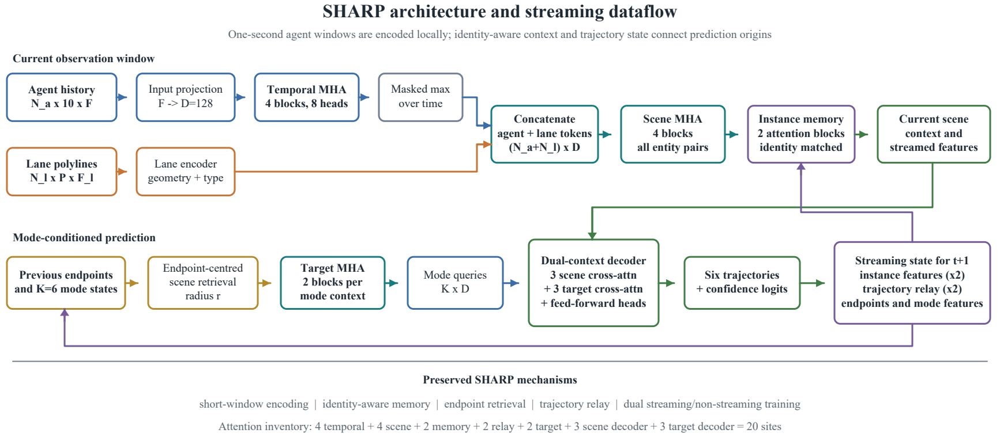

[SVG](Architectures/SHARP/reference_architecture.svg) / [PDF](Architectures/SHARP/reference_architecture.pdf) / [PNG](Architectures/SHARP/reference_architecture.png)

## 3.5: SHARP intervention locations

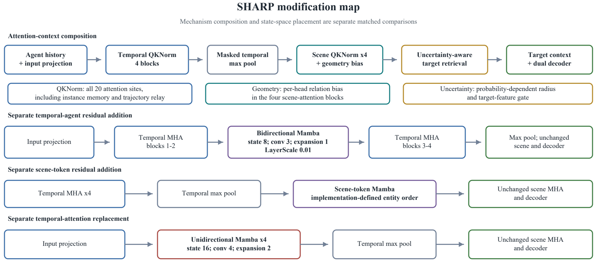

[SVG](Architectures/SHARP/intervention_locations.svg) / [PDF](Architectures/SHARP/intervention_locations.pdf) / [PNG](Architectures/SHARP/intervention_locations.png)

## 4.1: SEAM state-space integration: minADE6

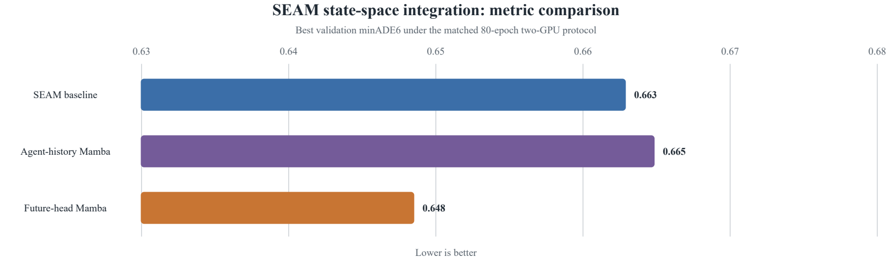

[SVG](Studies/SEAM/State_Space_Integration/selected_minade6.svg) / [PDF](Studies/SEAM/State_Space_Integration/selected_minade6.pdf) / [PNG](Studies/SEAM/State_Space_Integration/selected_minade6.png)

## 4.2: SEAM state-space integration: training time

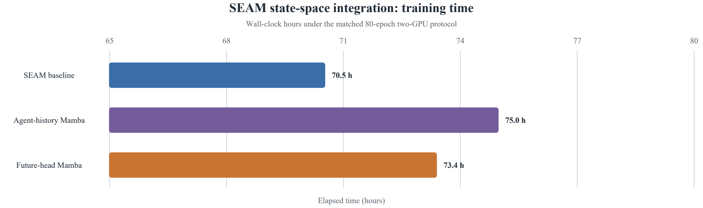

[SVG](Studies/SEAM/State_Space_Integration/training_time.svg) / [PDF](Studies/SEAM/State_Space_Integration/training_time.pdf) / [PNG](Studies/SEAM/State_Space_Integration/training_time.png)

## 4.3: SEAM context and attention ablation: minADE6

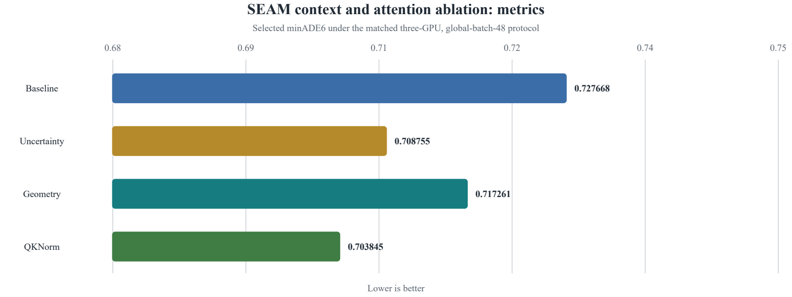

[SVG](Studies/SEAM/Context_Attention_Ablation/selected_minade6.svg) / [PDF](Studies/SEAM/Context_Attention_Ablation/selected_minade6.pdf) / [PNG](Studies/SEAM/Context_Attention_Ablation/selected_minade6.png)

## 4.4: SEAM context and attention ablation: training time

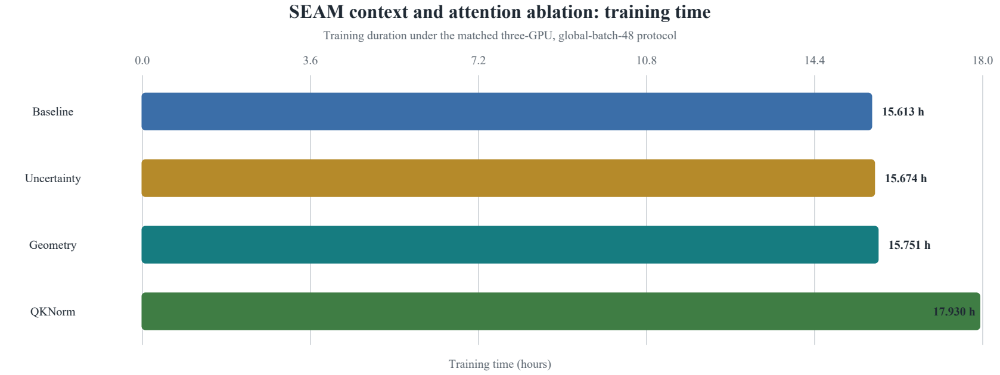

[SVG](Studies/SEAM/Context_Attention_Ablation/training_time.svg) / [PDF](Studies/SEAM/Context_Attention_Ablation/training_time.pdf) / [PNG](Studies/SEAM/Context_Attention_Ablation/training_time.png)

## 4.5: SHARP architectural ablation: minADE6

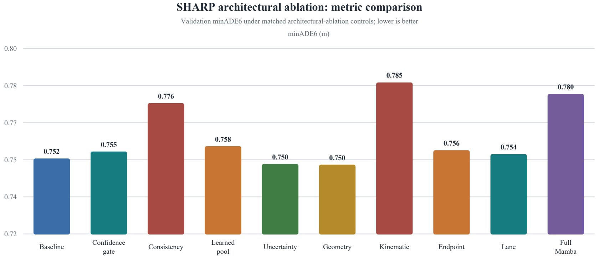

[SVG](Studies/SHARP/Architecture_Ablation/selected_minade6.svg) / [PDF](Studies/SHARP/Architecture_Ablation/selected_minade6.pdf) / [PNG](Studies/SHARP/Architecture_Ablation/selected_minade6.png)

## 4.6: SHARP architectural ablation: training time

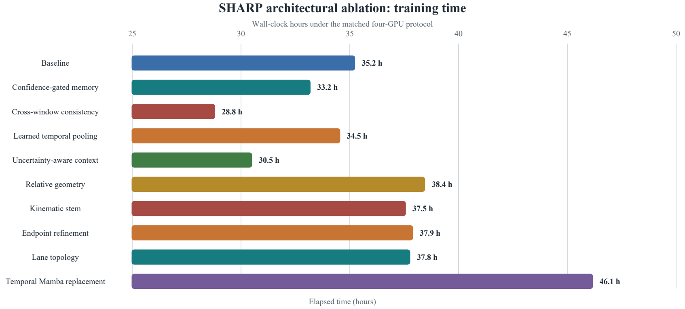

[SVG](Studies/SHARP/Architecture_Ablation/training_time.svg) / [PDF](Studies/SHARP/Architecture_Ablation/training_time.pdf) / [PNG](Studies/SHARP/Architecture_Ablation/training_time.png)

## 4.7: SHARP attention operators: minADE6

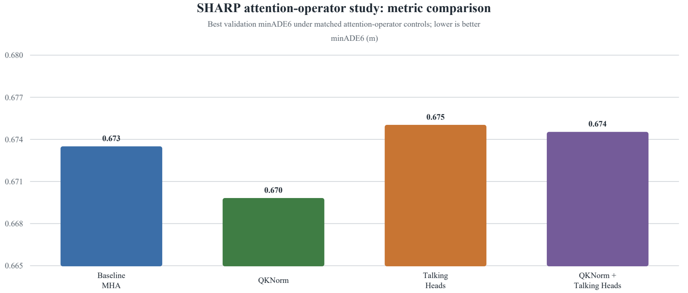

[SVG](Studies/SHARP/Attention_Operators/selected_minade6.svg) / [PDF](Studies/SHARP/Attention_Operators/selected_minade6.pdf) / [PNG](Studies/SHARP/Attention_Operators/selected_minade6.png)

## 4.8: SHARP attention operators: training time

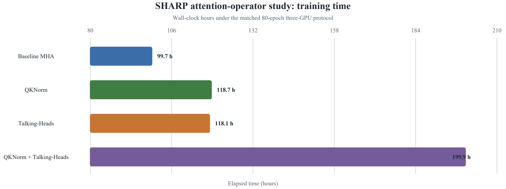

[SVG](Studies/SHARP/Attention_Operators/training_time.svg) / [PDF](Studies/SHARP/Attention_Operators/training_time.pdf) / [PNG](Studies/SHARP/Attention_Operators/training_time.png)

## 4.9: SHARP state-space placement: minADE6

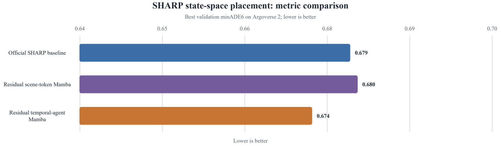

[SVG](Studies/SHARP/State_Space_Placement/selected_minade6.svg) / [PDF](Studies/SHARP/State_Space_Placement/selected_minade6.pdf) / [PNG](Studies/SHARP/State_Space_Placement/selected_minade6.png)

## 4.10: SHARP state-space placement: training time

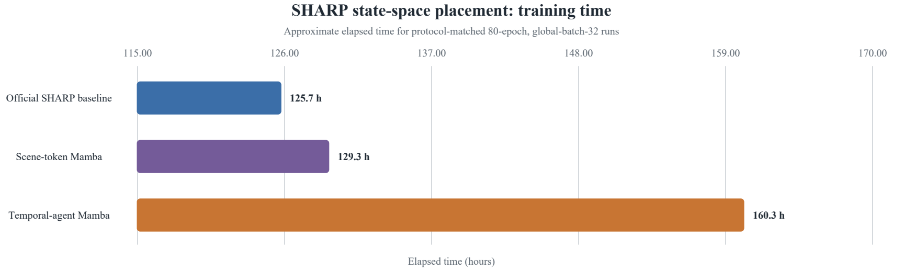

[SVG](Studies/SHARP/State_Space_Placement/training_time.svg) / [PDF](Studies/SHARP/State_Space_Placement/training_time.pdf) / [PNG](Studies/SHARP/State_Space_Placement/training_time.png)

## 4.11: SHARP mechanism composition: minADE6

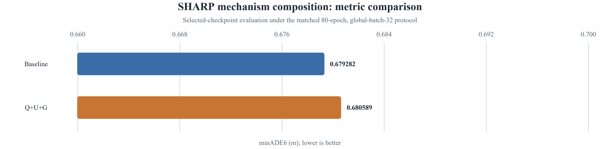

[SVG](Studies/SHARP/Mechanism_Composition/selected_minade6.svg) / [PDF](Studies/SHARP/Mechanism_Composition/selected_minade6.pdf) / [PNG](Studies/SHARP/Mechanism_Composition/selected_minade6.png)

## 4.12: SHARP mechanism composition: miss rate

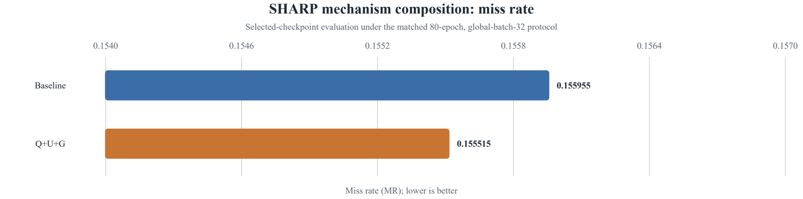

[SVG](Studies/SHARP/Mechanism_Composition/miss_rate.svg) / [PDF](Studies/SHARP/Mechanism_Composition/miss_rate.pdf) / [PNG](Studies/SHARP/Mechanism_Composition/miss_rate.png)

## 4.13: SHARP mechanism composition: training time

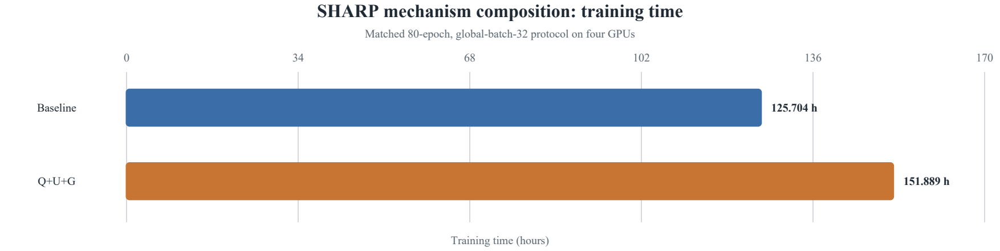

[SVG](Studies/SHARP/Mechanism_Composition/training_time.svg) / [PDF](Studies/SHARP/Mechanism_Composition/training_time.pdf) / [PNG](Studies/SHARP/Mechanism_Composition/training_time.png)

## 3.6: Experiment and evidence pipeline

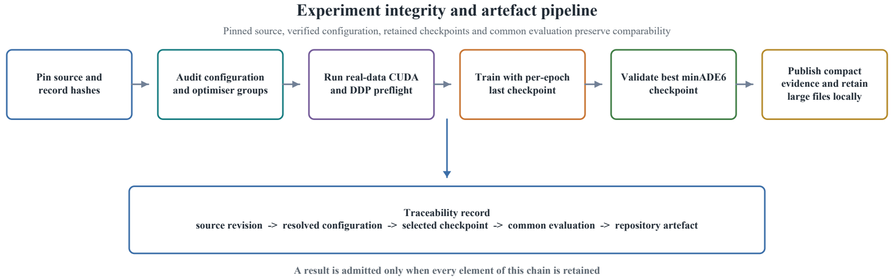

[SVG](Supporting_Evidence/experiment_evidence_pipeline.svg) / [PDF](Supporting_Evidence/experiment_evidence_pipeline.pdf) / [PNG](Supporting_Evidence/experiment_evidence_pipeline.png)

## A.1: Research evidence traceability

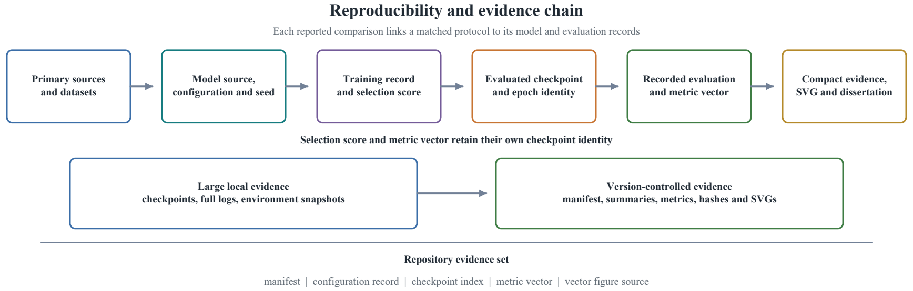

[SVG](Supporting_Evidence/research_evidence_traceability.svg) / [PDF](Supporting_Evidence/research_evidence_traceability.pdf) / [PNG](Supporting_Evidence/research_evidence_traceability.png)
